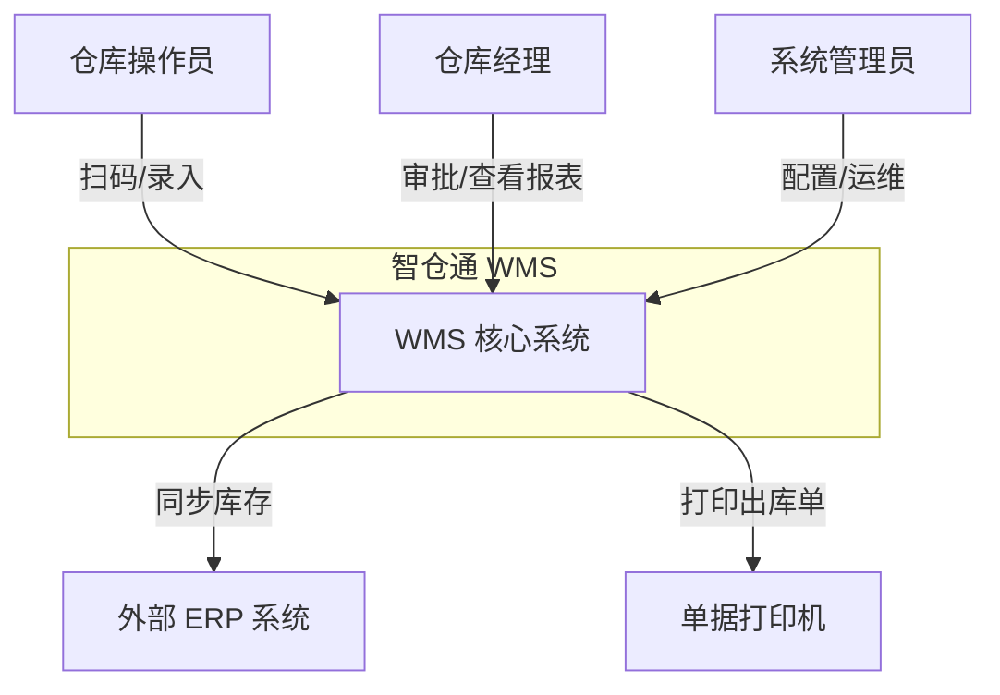
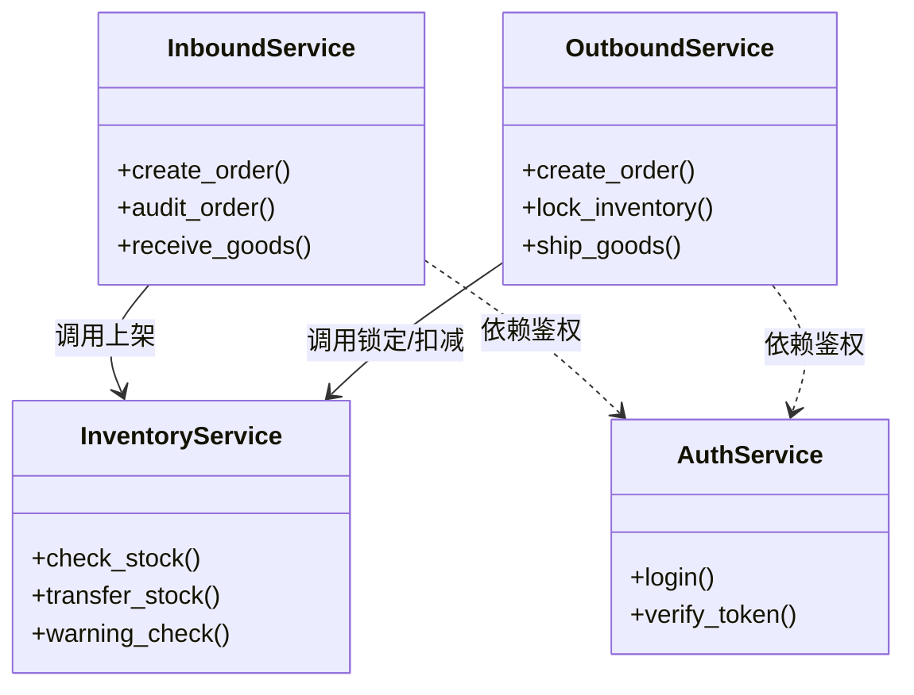
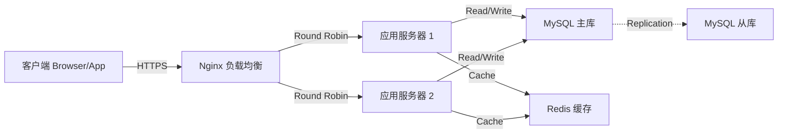

# 系统架构设计 (System Architecture Design)

## 1. 架构设计原则 (Design Principles)
本系统设计遵循以下核心原则：
- **高内聚低耦合**：各功能模块（入库、出库、库存）独立封装，通过标准接口交互。
- **无状态设计**：API 层不保存会话状态，便于横向扩展。
- **分层架构**：严格区分表现层、业务层、持久层，禁止跨层调用。

## 2. C4 架构模型 (C4 Model)

### 2.1 上下文图 (Context Diagram)
展示系统与外部用户及系统的交互边界。



### 2.2 容器图 (Container Diagram)
详见 [index.md](./index.md) 中的容器图部分。

### 2.3 组件图 (Component Diagram - Backend)
后端核心组件及其依赖关系。



## 3. 数据库设计 (Database Design)

### 3.1 核心 E-R 图 (Entity-Relationship Diagram)

```mermaid
erDiagram
    Product ||--o{ InventoryItem : stores
    Warehouse ||--o{ InventoryItem : contains
    
    InboundOrder ||--|{ InboundOrderItem : has
    InboundOrder }o--|| Supplier : from
    InboundOrder }o--|| Warehouse : to
    
    OutboundOrder ||--|{ OutboundOrderItem : has
    OutboundOrder }o--|| Customer : to
    OutboundOrder }o--|| Warehouse : from
    
    InventoryItem {
        int id PK
        string sku
        string location
        int qty
        int locked_qty
    }
```

### 3.2 数据库选型与优化
- **选型**：MySQL 8.0，支持 InnoDB 引擎，保障事务 ACID 特性。
- **索引策略**：
  - `sku_code`：唯一索引，加速商品查询。
  - `order_no`：唯一索引，防止单号重复。
  - `(product_sku, warehouse_code)`：联合索引，优化库存聚合查询。
- **分库分表规划**：当前单库设计，预留 `warehouse_code` 作为分片键 (Sharding Key)。

## 4. 网络拓扑与部署 (Network Topology)



## 5. 接口设计规范 (API Design Guidelines)
- **协议**：HTTP/1.1 (计划升级 HTTP/2)。
- **格式**：JSON。
- **版本控制**：URL 路径版本化，如 `/api/v1/products`。
- **状态码**：
  - `200 OK`：成功。
  - `400 Bad Request`：业务逻辑错误（如库存不足）。
  - `401 Unauthorized`：未登录。
  - `403 Forbidden`：无权限。
  - `500 Internal Server Error`：系统内部错误。

## 6. 关键技术难点与解决方案
1.  **库存超卖**：
    - **问题**：高并发下多个请求同时读取库存并扣减。
    - **解法**：使用 `SELECT ... FOR UPDATE` 行锁，或 `UPDATE inventory SET qty = qty - n WHERE qty >= n` 的乐观锁写法。
2.  **大报表性能**：
    - **问题**：千万级数据实时聚合导致数据库 CPU 飙升。
    - **解法**：采用每日凌晨离线计算昨日报表，存入 `ReportDaily` 表；实时报表仅计算当日增量数据。
