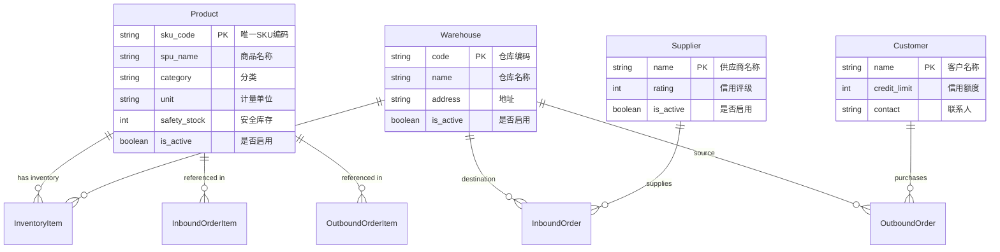

# 基础数据模块 (Base Data Module)

## 1. 模块概述 (Overview)
基础数据模块是 WMS 系统的基石，负责维护商品、仓库、供应商和客户等核心主数据。该模块的数据准确性直接影响库存计算、单据流转及报表统计的可靠性。

## 2. 领域建模 (Domain Modeling)

### 2.1 实体关系图 (Entity-Relationship Diagram)



### 2.2 数据字典 (Data Dictionary)

| 实体 | 字段 | 类型 | 约束 | 描述 |
| :--- | :--- | :--- | :--- | :--- |
| **Product** | `sku_code` | Varchar(50) | Unique | 商品唯一标识，用于扫码和系统流转。 |
| | `safety_stock` | Integer | >= 0 | 安全库存阈值，低于此值触发预警。 |
| **Warehouse** | `code` | Varchar(50) | Unique | 仓库物理节点的逻辑标识。 |
| **Supplier** | `rating` | Integer | 0-5 | 供应商绩效评分，影响采购优先级。 |
| **Customer** | `credit_limit` | Integer | >= 0 | 客户赊销额度上限。 |

## 3. 关键代码实现 (Implementation Details)

### 3.1 领域模型定义 (Django Models)
以下是核心基础数据的 Django ORM 定义，体现了数据完整性约束。

```python
# backend/api/models.py

class Product(models.Model):
    sku_code = models.CharField(max_length=50, unique=True, verbose_name="SKU编码")
    spu_name = models.CharField(max_length=100, verbose_name="商品名称")
    category = models.CharField(max_length=50, blank=True, null=True, verbose_name="分类")
    unit = models.CharField(max_length=10, blank=True, null=True, verbose_name="单位")
    safety_stock = models.IntegerField(default=0, verbose_name="安全库存")
    is_active = models.BooleanField(default=True, verbose_name="是否启用")
    
    class Meta:
        verbose_name = "商品"
        indexes = [
            models.Index(fields=['sku_code']),
            models.Index(fields=['category']),
        ]

class Warehouse(models.Model):
    code = models.CharField(max_length=50, unique=True, verbose_name="仓库编码")
    name = models.CharField(max_length=100, verbose_name="仓库名称")
    is_active = models.BooleanField(default=True, verbose_name="是否启用")
```

### 3.2 数据校验逻辑 (Validation Logic)
在 API 层面，我们实现了严格的数据校验，防止脏数据录入。

```python
# 示例：创建商品时的重复性校验
def validate_product_unique(sku_code):
    if Product.objects.filter(sku_code=sku_code).exists():
        raise ValidationError(f"SKU {sku_code} 已存在")
```

## 4. 接口契约 (API Contracts)

本模块遵循 RESTful 规范，所有接口均需通过 `Bearer Token` 认证。

### 4.1 商品管理接口

| 方法 | 路径 | 描述 | 参数示例 |
| :--- | :--- | :--- | :--- |
| GET | `/api/products` | 分页查询商品列表 | `?page=1&pageSize=10&keyword=IPhone` |
| POST | `/api/products` | 新增商品 | `{ "sku_code": "P001", "spu_name": "IPhone 15", "safety_stock": 10 }` |
| PUT | `/api/products` | 更新商品信息 | `{ "id": 1, "safety_stock": 20 }` |
| DELETE | `/api/products` | 删除商品 | `{ "id": 1 }` |

#### 响应示例 (Response Example)
```json
{
  "code": 200,
  "message": "success",
  "data": {
    "list": [
      {
        "id": 1,
        "sku_code": "P001",
        "spu_name": "IPhone 15",
        "category": "Electronics",
        "safety_stock": 10,
        "is_active": true,
        "updated_at": "2023-10-01T12:00:00+08:00"
      }
    ],
    "total": 100,
    "page": 1,
    "pageSize": 10
  }
}
```

## 5. 异常处理 (Exception Handling)

| 错误码 | 描述 | 解决方案 |
| :--- | :--- | :--- |
| `400 Bad Request` | 参数校验失败（如 SKU 重复） | 检查输入数据唯一性 |
| `401 Unauthorized` | Token 过期或未携带 | 跳转登录页重新获取 Token |
| `403 Forbidden` | 权限不足 | 联系管理员分配对应角色 |
| `409 Conflict` | 数据关联冲突（如删除已使用的商品） | 先归档或清理关联业务数据 |

## 6. 局限性与未来工作 (Limitations & Future Work)
- **当前局限**：目前仅支持单级商品分类，缺乏多规格（SKU/SPU）变体管理。
- **未来规划**：引入商品条码（Barcode）多对一映射，支持一品多码管理。
