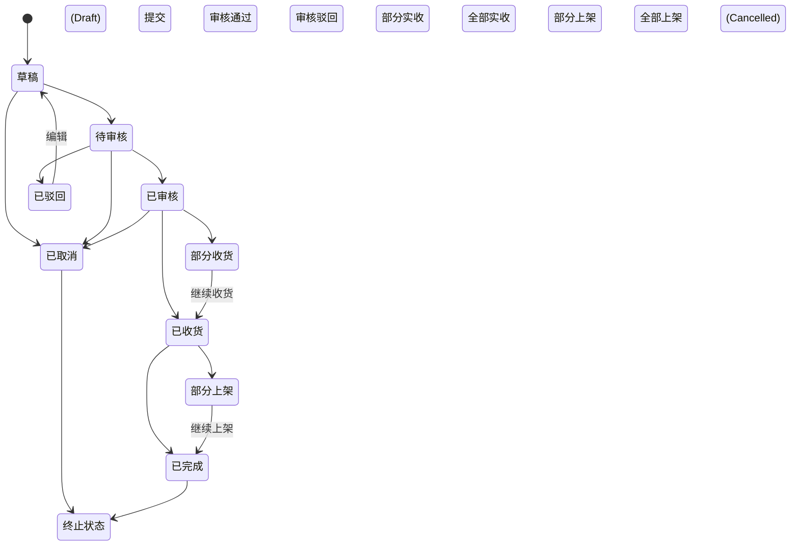
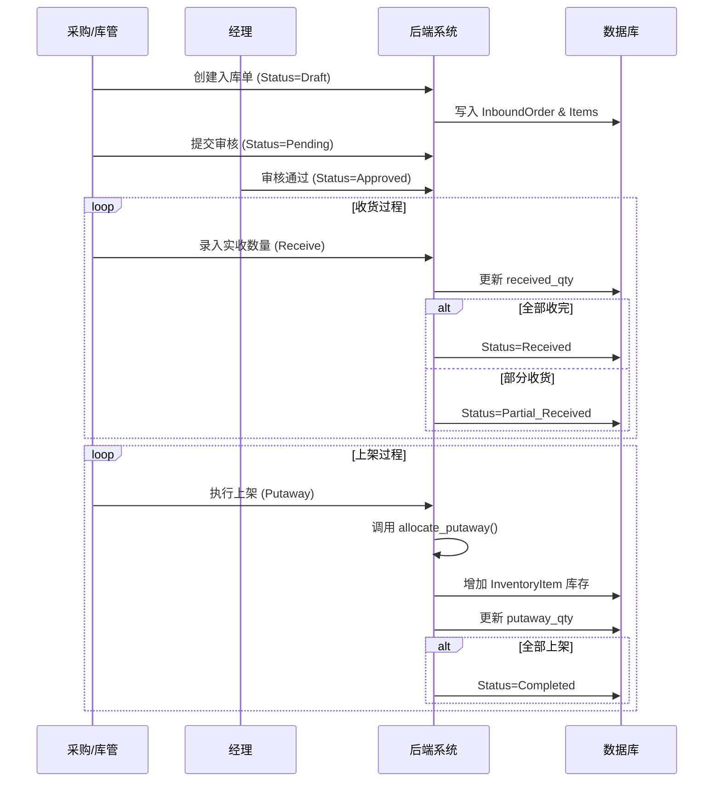

# 入库模块 (Inbound Module)

## 1. 模块概述 (Overview)
入库模块管理商品从供应商到仓库上架的全过程，包括入库申请、审核、收货及上架。系统通过状态机控制流程流转，确保操作合规。

## 2. 状态机与业务流程 (State Machine & Workflow)

### 2.1 状态流转图 (State Transition Diagram)



### 2.2 核心业务时序图 (Core Sequence Diagram)



## 3. 关键代码实现 (Implementation Details)

### 3.1 状态流转校验 (State Transition Validation)
系统使用 `validate_status_transition` 函数确保只有合法的状态变更被允许。

```python
# backend/api/views.py

def validate_status_transition(flow, old_status, new_status):
    allowed = {
        '草稿': ['待审核', '已取消'],
        '待审核': ['已审核', '已驳回', '已取消'],
        '已审核': ['部分收货', '已收货', '已完成', '已取消'],
        # ... 其他状态流转规则
    }
    return new_status in allowed.get(old_status, [])
```

### 3.2 自动库位分配算法 (Automatic Allocation)
系统在上架时会调用 `allocate_putaway`，自动寻找或创建专用库位。

```python
# backend/api/views.py (Simplified)

def allocate_putaway(warehouse_code, product_sku, qty):
    # 1. 优先填充已有该 SKU 的未满库位
    slots = InventoryItem.objects.filter(
        product_sku=product_sku, 
        warehouse_code=warehouse_code
    ).order_by('location_code')
    
    remaining = qty
    allocations = []
    
    for slot in slots:
        if remaining <= 0: break
        space = 100 - slot.quantity  # 假设每个库位容量 100
        if space > 0:
            put = min(space, remaining)
            slot.quantity += put
            slot.save()
            allocations.append({'loc': slot.location_code, 'qty': put})
            remaining -= put
            
    return allocations
```

## 4. 接口契约 (API Contracts)

| 方法 | 路径 | 描述 | 关键参数 |
| :--- | :--- | :--- | :--- |
| POST | `/api/inbound/orders` | 创建入库单 | `supplier_name`, `items` |
| PUT | `/api/inbound/orders` | 状态变更/收货/上架 | `action`: `submit/approve/receive/putaway` |
| GET | `/api/inbound/orders` | 查询入库单 | `action=putaway_preview` (获取上架建议) |

### 4.1 上架建议接口 (Putaway Suggestion)
系统提供 `putaway_preview` 动作，返回建议的库位分配方案。

**请求示例:**
`GET /api/inbound/orders?action=putaway_preview&warehouse_code=WH01&product_sku=P001&quantity=50`

**响应示例:**
```json
{
    "allocations": [
        { "location_code": "A-01-01", "quantity": 20 },
        { "location_code": "A-01-02", "quantity": 30 }
    ]
}
```

## 5. 异常处理矩阵 (Exception Matrix)

| 场景 | 异常描述 | HTTP 状态码 | 系统行为 |
| :--- | :--- | :--- | :--- |
| **重复收货** | 实收数量 > 计划数量 | 400 | 拒绝操作，提示“超出计划数量” |
| **库位已满** | 上架数量 > 库位剩余容量 | 400 | 提示容量不足，建议拆分库位 |
| **状态非法** | 尝试对“已完成”订单进行收货 | 400 | 拦截非法状态流转 |

## 6. 局限性 (Limitations)
- 暂不支持收货时的 **质检 (QC)** 环节，默认实收即良品。
- 不支持 **超额收货** (Over-receiving)，需修改订单数量后方可录入。
