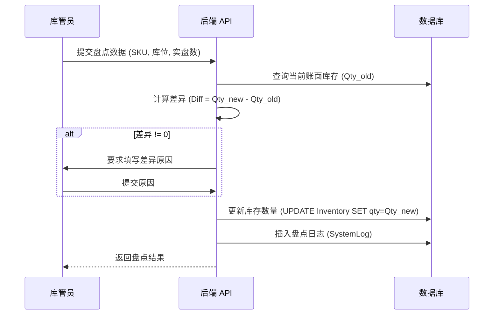

# 库存模块 (Inventory Module)

## 1. 模块概述 (Overview)
库存模块是 WMS 的核心，负责维护实物库存的准确性与实时性。该模块涵盖了库存查询、盘点、调拨及预警四大功能，通过严格的事务控制和锁机制保障数据一致性。

## 2. 核心算法 (Core Algorithms)

### 2.1 库位分配算法 (Location Allocation Algorithm)
系统采用基于规则的“专用库位优先 + 顺序填充”策略。

**伪代码 (Pseudocode):**
```python
FUNCTION allocate_putaway(warehouse, sku, qty):
    # 1. 查找或创建专用库位 (每 SKU 预留 10 个库位)
    slots = GET_OR_CREATE_DEDICATED_SLOTS(warehouse, sku)
    
    remaining = qty
    allocations = []
    
    FOR slot IN slots:
        IF remaining <= 0: BREAK
        
        # 计算库位剩余容量 (Max = 100)
        space = 100 - slot.quantity
        IF space > 0:
            put_qty = MIN(space, remaining)
            slot.quantity += put_qty
            SAVE(slot)
            APPEND allocations: {slot.code, put_qty}
            remaining -= put_qty
            
    IF remaining > 0:
        THROW Error("库存容量不足")
        
    RETURN allocations
```

### 2.2 库存预警模型 (Inventory Warning Model)
系统实时监控各仓库的库存水位，触发条件如下：

$$ S_{total}(sku, wh) = \sum_{i=1}^{n} Q_{i} $$
$$ Alert \iff S_{total} \le S_{safety}(sku) $$

其中：
- $S_{total}$：某 SKU 在指定仓库的总物理库存。
- $Q_i$：该 SKU 在第 $i$ 个库位的数量。
- $S_{safety}$：该 SKU 的基础安全库存阈值。

## 3. 业务流程与状态机 (Business Process & State Machine)

### 3.1 库存盘点流程 (Stocktaking Process)



### 3.2 库存调拨逻辑 (Transfer Logic)
调拨操作严格遵循 ACID 事务原则，确保“源扣减”与“目增加”原子性执行。

1.  **开启事务**。
2.  **锁定源库存**：`SELECT * FROM inventory WHERE ... FOR UPDATE`。
3.  **校验**：检查源库位可用数量 $\ge$ 调拨数量。
4.  **扣减**：`source.qty -= amount`。
5.  **增加**：`target.qty += amount` (若目标记录不存在则创建)。
6.  **提交事务**。

## 4. 并发控制与数据一致性 (Concurrency Control)

| 场景 | 冲突类型 | 解决方案 |
| :--- | :--- | :--- |
| **多单同时发货** | 扣减同一 SKU 库存 | 数据库行级锁 (Row-Level Locking) |
| **入库与盘点冲突** | 上架同时修改数量 | 乐观锁 (Optimistic Locking) 或 事务隔离 |
| **库存超卖** | 高并发下单 | 预扣减 (Pre-deduction) + 最终一致性校验 |

## 5. 局限性与未来工作 (Limitations & Future Work)
- **当前局限**：
  - 库位容量固定为 100，不支持按体积/重量动态计算。
  - 尚未实现批次管理 (Batch Management)，无法精确追踪先进先出。
- **未来规划**：
  - 引入 `Redis` 缓存热点库存，提升高并发查询性能。
  - 实现基于 `Celery` 的异步库存对账任务。
