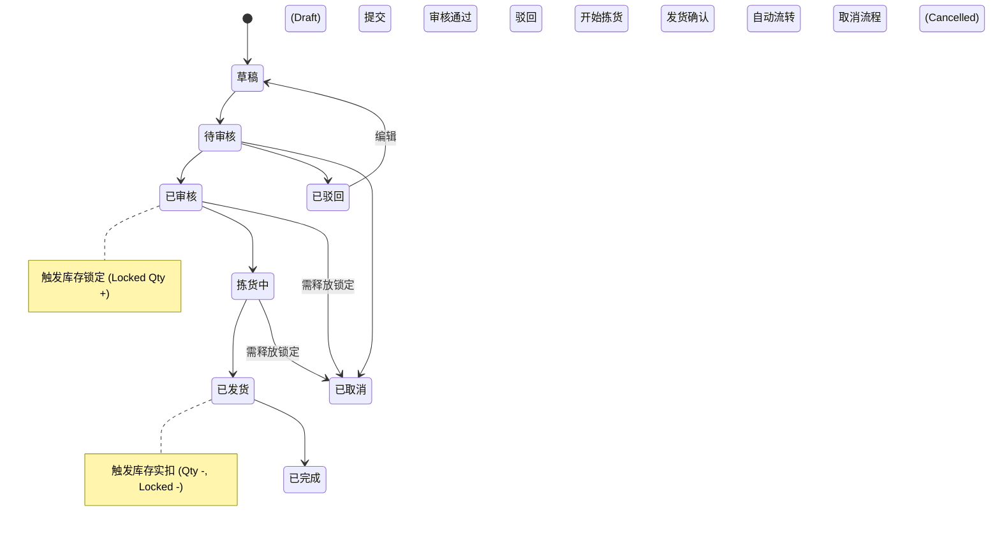
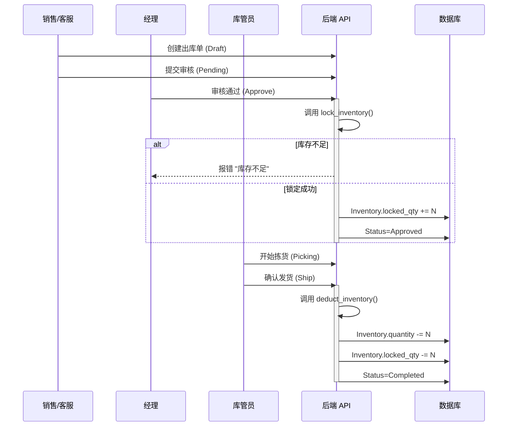

# 出库模块 (Outbound Module)

## 1. 模块概述 (Overview)
出库模块负责处理客户订单的发货请求。其核心难点在于**库存锁定策略**与**高并发下的超卖防止**。系统采用“审核即锁定，发货即扣减”的二阶段提交机制。

## 2. 状态机与业务流程 (State Machine & Workflow)

### 2.1 状态流转图 (State Transition Diagram)



### 2.2 核心业务时序图 (Core Sequence Diagram)



## 3. 核心算法与实现 (Core Algorithms & Implementation)

### 3.1 库存锁定算法 (Inventory Locking Algorithm)
系统优先锁定“库位编码较小”的库存（模拟先进先出，若库位按时间顺序排列）。

**伪代码 (Pseudocode):**
```python
FUNCTION lock_inventory(order_items):
    # 第一步：预检总可用库存
    FOR item IN order_items:
        available = SUM(inv.qty - inv.locked_qty FOR inv IN item.sku)
        IF available < item.qty:
            THROW Error("库存不足")

    # 第二步：执行锁定
    FOR item IN order_items:
        remaining = item.qty
        # 按库位顺序查找库存记录
        inventory_list = DB.FIND(sku=item.sku).ORDER_BY(location_code)
        
        FOR inv IN inventory_list:
            IF remaining <= 0: BREAK
            
            can_lock = inv.qty - inv.locked_qty
            lock_amount = MIN(can_lock, remaining)
            
            inv.locked_qty += lock_amount
            remaining -= lock_amount
            DB.SAVE(inv)
```

### 3.2 扣减库存实现 (Deduction Logic)
在发货阶段，系统将执行物理扣减，同时释放锁定。

```python
# backend/api/views.py (Snippet)

def deduct_inventory(order_items, warehouse_code):
    for item in order_items:
        remaining = item.quantity
        # 优先扣减已锁定的记录
        inv_items = InventoryItem.objects.filter(
            product_sku=item.product_sku,
            locked_qty__gt=0
        )
        
        for inv in inv_items:
            if remaining <= 0: break
            deduct = min(inv.locked_qty, remaining)
            inv.quantity -= deduct
            inv.locked_qty -= deduct
            inv.save()
            remaining -= deduct
```

## 4. 接口契约 (API Contracts)

| 方法 | 路径 | 描述 | 关键逻辑 |
| :--- | :--- | :--- | :--- |
| POST | `/api/outbound/orders` | 创建出库单 | 初始状态为草稿 |
| PUT | `/api/outbound/orders` | 状态变更 | `action=approve` 触发锁定；`action=cancel` 触发释放 |

## 5. 异常处理 (Exception Handling)

| 异常场景 | HTTP 状态码 | 处理逻辑 |
| :--- | :--- | :--- |
| **库存不足** | 400 | 审核失败，前端提示具体缺货的 SKU 及可用数量。 |
| **锁定释放失败** | 500 | 事务回滚，确保锁定数量不出现负数。 |
| **重复发货** | 400 | 状态校验拦截。 |

## 6. 局限性 (Limitations)
- **缺乏波次拣货**：目前仅支持按单拣货，未实现多订单合并波次 (Wave Picking)。
- **锁定粒度**：当前锁定基于库位记录，未支持“指定批次锁定”。
