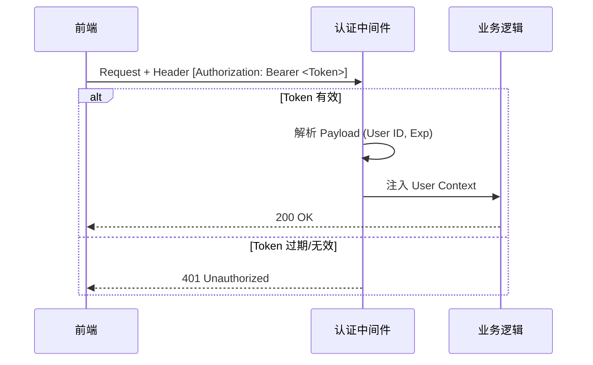

# 系统管理模块 (System Management)

## 1. 模块概述 (Overview)
本模块处理身份认证、权限控制及安全审计，是保障系统安全运行的“防火墙”。系统采用 **RBAC (Role-Based Access Control)** 模型实现精细化权限管理。

## 2. 安全架构 (Security Architecture)

### 2.1 认证与授权流程 (Authentication & Authorization)
系统采用 **JWT (JSON Web Token)** 无状态认证机制。



### 2.2 权限模型 (RBAC Model)
- **用户 (User)**：系统操作主体，通过 `username` 唯一标识。
- **角色 (Role)**：权限集合的抽象，当前系统预置角色：
  - `admin`：超级管理员，拥有所有权限。
  - `manager`：经理，拥有审批权，无系统配置权。
  - `operator`：操作员，仅负责执行（收货/拣货）。
  - `viewer`：只读访客。

## 3. 审计日志 (Audit Logging)
系统全量记录关键业务操作，满足合规性审计需求。

| 字段 | 说明 | 示例 |
| :--- | :--- | :--- |
| `operator` | 操作人账号 | `admin` |
| `action` | 动作类型 | `入库单审核` |
| `detail` | 详细快照 | `入库单 IN-20231001 状态变更为已审核` |
| `created_at` | 精确时间戳 | `2023-10-01 10:00:00.123` |

## 4. 安全威胁建模 (Security Threat Modeling)

| 威胁 (STRIDE) | 潜在风险 | 防御策略 |
| :--- | :--- | :--- |
| **Spoofing (欺骗)** | 伪造用户身份 | JWT 签名校验 (HS256) |
| **Tampering (篡改)** | 修改订单金额/数量 | 数据库事务 + 后端参数强校验 |
| **Repudiation (抵赖)** | 否认敏感操作 | `SystemLog` 强制记录，不可篡改 |
| **Information Disclosure (泄露)** | 导出客户隐私数据 | 接口鉴权 + 敏感字段脱敏 |
| **Denial of Service (拒绝服务)** | 恶意高频请求 | Nginx 限流 (Rate Limiting) |

## 5. 部署与运维指南 (Deployment & Maintenance)

为了确保系统的高可用性与易维护性，我们推荐以下标准部署方案。

### 5.1 Docker 容器化部署
建议使用 Docker Compose 编排服务，确保环境一致性。

**Dockerfile 示例 (Backend):**
```dockerfile
FROM python:3.10-slim

WORKDIR /app
COPY requirements.txt .
RUN pip install --no-cache-dir -r requirements.txt

COPY . .

# 使用 Gunicorn 启动生产级服务器
CMD ["gunicorn", "app.wsgi:application", "--bind", "0.0.0.0:8000", "--workers", "4"]
```

**docker-compose.yml 示例:**
```yaml
version: '3'
services:
  db:
    image: mysql:8.0
    environment:
      MYSQL_ROOT_PASSWORD: secure_password
      MYSQL_DATABASE: wms
    volumes:
      - db_data:/var/lib/mysql

  backend:
    build: ./backend
    ports:
      - "8000:8000"
    depends_on:
      - db
    environment:
      DB_HOST: db
      DB_PASSWORD: secure_password

  frontend:
    build: ./frontend
    ports:
      - "80:80"
    depends_on:
      - backend

volumes:
  db_data:
```

### 5.2 CI/CD 流水线 (CI/CD Pipeline)
推荐使用 GitLab CI 或 GitHub Actions 实现自动化部署。

1.  **代码提交 (Push)**：触发单元测试。
2.  **构建 (Build)**：构建 Docker 镜像并推送至私有仓库。
3.  **部署 (Deploy)**：SSH 连接生产服务器，执行 `docker-compose up -d` 更新服务。

### 5.3 数据库备份策略
- **全量备份**：每日凌晨 2:00 执行 `mysqldump`。
- **增量备份**：开启 MySQL Binlog，实时记录数据变更。

## 6. 局限性 (Limitations)
- **Token 吊销**：由于 JWT 无状态特性，用户登出后旧 Token 在过期前依然有效（需引入 Redis 黑名单机制解决）。
- **动态权限**：目前角色权限硬编码在前端和后端逻辑中，尚未实现基于界面的动态权限配置。
